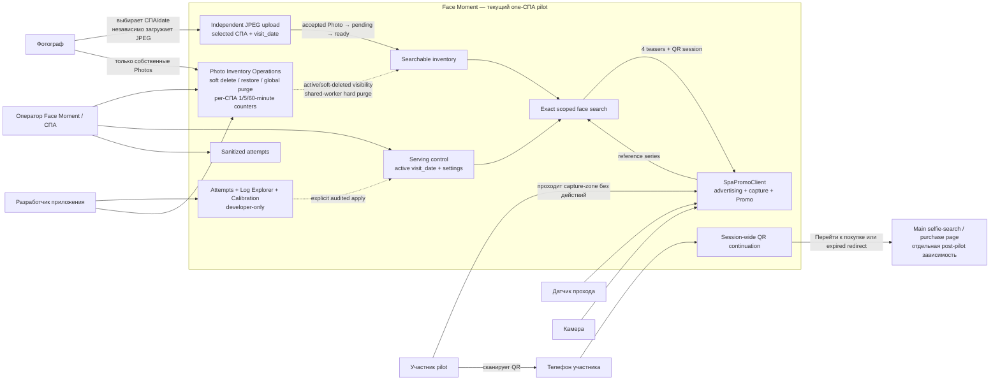

# 1. Product context and roles

Диаграмма показывает участников, текущую границу one-СПА pilot и отдельную post-pilot зависимость.

## Что важно

- Promo display завлекает, но не является touchscreen kiosk.
- В pilot участник не загружает selfie и не получает original.
- Оператор видит только sanitized attempt summary; protected artifacts и Calibration доступны разработчику.
- Фотограф soft-delete/restore только свои uploads; оператор/разработчик могут
  действовать в доступных СПА, а global restore/purge охватывает весь проект.
- Soft-deleted Photo отсутствует в новых search/results/statistics, но уже
  выданная session продолжает использовать media. Hard purge сохраняет session,
  core Attempt и diagnostic evidence; отсутствующая media пропускается.
- Повторные QR scans используют один session-wide browser access context без
  per-device grants.

Источники: [PRD](../.memory-bank/prd.md),
[Architecture](../arch_vision.md), [Product
Brief](../.memory-bank/analysis/product-brief.md),
[Glossary](../.memory-bank/glossary.md).
