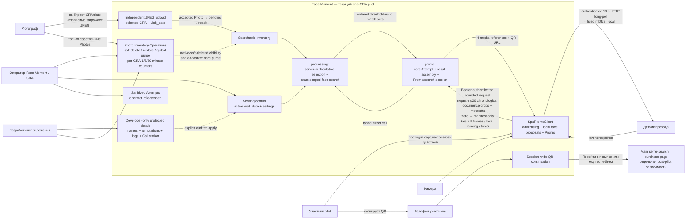

# 1. Product context and roles

Диаграмма показывает участников, текущую границу one-СПА pilot и отдельную post-pilot зависимость.

## Что важно

- Promo display завлекает, но не является touchscreen kiosk.
- В pilot участник не загружает selfie и не получает original.
- Операторский Attempts view содержит только sanitized summary. Participant
  names, manual annotations, detailed logs, Calibration и protected non-media
  доступны разработчику; capture-derived media не становится developer-only
  только из-за image content.
- Фотограф soft-delete/restore только свои uploads; оператор/разработчик могут
  действовать в доступных СПА, а global restore/purge охватывает весь проект.
- Soft-deleted Photo отсутствует в новых search/results/statistics, но уже
  выданная session продолжает использовать media. Hard purge сохраняет session,
  core Attempt и diagnostic evidence; отсутствующая media пропускается.
- Повторные QR scans используют один session-wide browser access context без
  per-device grants.

Источники: [PRD](../.memory-bank/prd.md),
[Features](../.memory-bank/features/index.md),
[Architecture](../.memory-bank/architecture/system-architecture.md),
[Boundary map](../.memory-bank/contracts/boundary-map.md),
[Lifecycle](../.memory-bank/states/lifecycle-map.md),
[Glossary](../.memory-bank/glossary.md).
