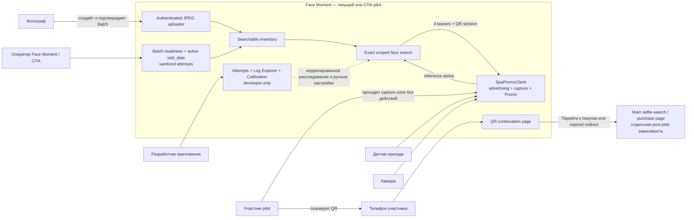

# 1. Product context and roles

Диаграмма показывает участников, текущую границу one-СПА pilot и отдельную post-pilot зависимость.

## Что важно

- Promo display завлекает, но не является touchscreen kiosk.
- В pilot участник не загружает selfie и не получает original.
- Оператор видит только sanitized attempt summary; protected artifacts и Calibration доступны разработчику.

Источники: [Product Brief](../.memory-bank/analysis/product-brief.md), [PRD](../.memory-bank/prd.md), [Glossary](../.memory-bank/glossary.md).
