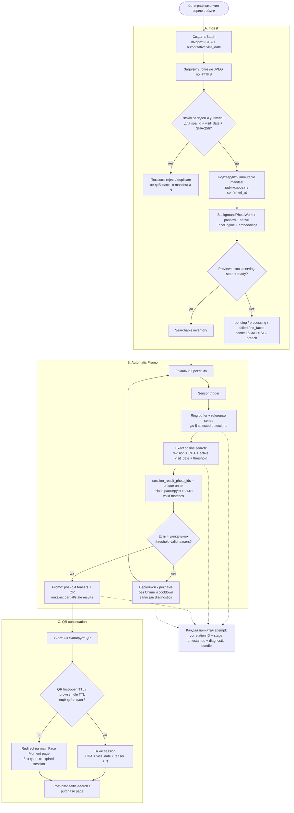

# 2. End-to-end pilot flow

Сквозной путь от подтверждения Batch до продолжения той же персональной session на телефоне.

## Acceptance anchors

- Не менее 95% unique accepted JPEG должны стать searchable менее чем за 15 минут от `batch.confirmed_at`.
- Не менее 19 из 20 controlled attempts должны показать полностью видимый QR менее чем за 10 секунд от `reference_series_ready_at`.
- Иностранная фотография в четырёх teasers или в `N` делает attempt некорректной; полное покрытие каждого человека группы не обещается.

Источники: [PRD](../.memory-bank/prd.md), [IDEA_INGEST.md](../IDEA_INGEST.md), [IDEA_APP.md](../IDEA_APP.md).
