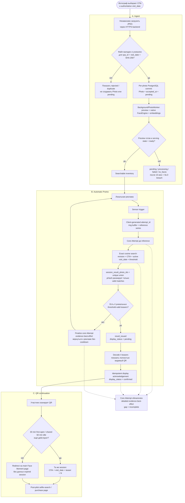

# 2. End-to-end pilot flow

Сквозной путь от независимой загрузки JPEG до продолжения той же персональной
session на телефоне.

## Acceptance anchors

- Не менее 95% independently accepted unique JPEG должны стать searchable менее
  чем за 15 минут от `photo.accepted_at`.
- Не менее 19 из 20 controlled attempts должны получить подтверждённый полностью
  видимый QR менее чем за 10 секунд по client monotonic interval от
  `reference_series_ready`.
- Иностранная фотография в четырёх teasers или в `N` делает attempt некорректной; полное покрытие каждого человека группы не обещается.

Источники: [PRD](../.memory-bank/prd.md),
[Architecture](../arch_vision.md), [IDEA_INGEST.md](../IDEA_INGEST.md),
[IDEA_APP.md](../IDEA_APP.md).
