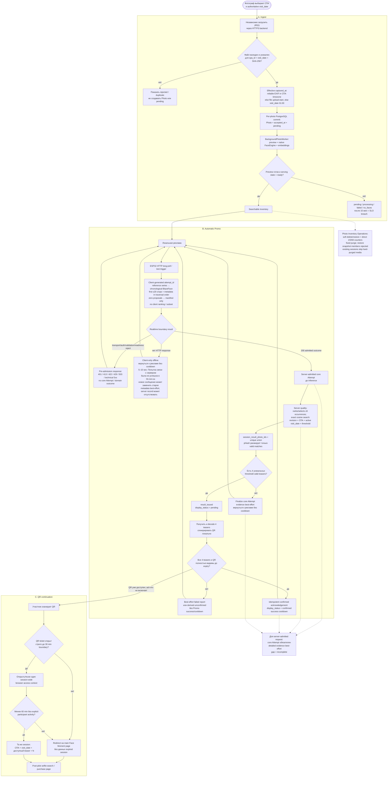

# 2. End-to-end pilot flow

Сквозной путь от независимой загрузки JPEG до продолжения той же персональной
session на телефоне.

## Acceptance anchors

- Не менее 95% independently accepted unique JPEG должны стать searchable менее
  чем за 15 минут от `photo.accepted_at`.
- Не менее 19 из 20 controlled attempts должны получить подтверждённый полностью
  видимый QR менее чем за 10 секунд по client monotonic interval от
  `reference_series_ready`, включая local processing и request send.
- Иностранная фотография в четырёх teasers или в `N` делает attempt некорректной; полное покрытие каждого человека группы не обещается.
- Soft-deleted Photos исключены из новых search/results/statistics, но уже
  выданная session продолжает использовать media. Hard purge удаляет
  Photo-owned данные, сохраняет session/core Attempt/evidence, а client
  пропускает отсутствующую media без пересчёта `N`.

Источники: [PRD](../.memory-bank/prd.md),
[Architecture](../.memory-bank/architecture/system-architecture.md),
[Boundary map](../.memory-bank/contracts/boundary-map.md),
[Photo Admission](../.memory-bank/domains/photo-admission.md),
[Photo Processing](../.memory-bank/domains/photo-processing.md),
[Realtime Attempt API](../.memory-bank/contracts/realtime-attempt-api.md),
[Promo Display API](../.memory-bank/contracts/promo-display-api.md),
[QR Continuation API](../.memory-bank/contracts/qr-continuation-api.md).
