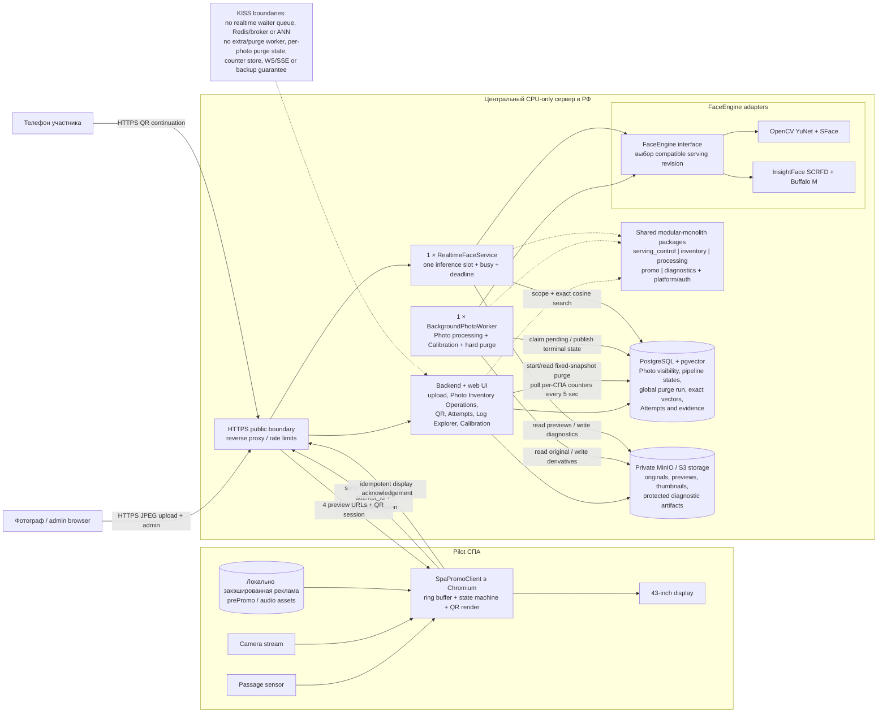

# 3. Runtime architecture

Минимальная single-server топология pilot. Это целевая архитектура, а не утверждение о текущей степени реализации.

## Ключевые границы

- `BackgroundPhotoWorker` и `RealtimeFaceService` разделены из-за разных latency и lifecycle требований.
- Пять capability slices являются package ownership, а не отдельными services.
- Realtime не ставит запросы в waiter queue: занятый slot возвращает `busy`.
- Serving pipeline заранее загружается и прогревается; второй pipeline нужен только при доказанной необходимости benchmark-а.
- `inventory` владеет active/soft-deleted marker, direct PostgreSQL counters и
  одним resumable global purge run; worker ждёт текущую операцию без preemption.
- Hard purge удаляет Photo/media/faces/pipeline и Promo result/session, но
  сохраняет core Attempt и diagnostic evidence.
- PostgreSQL, MinIO и внутренние service ports не публикуются наружу.
- Локальный HDMI client и будущий remote client используют один `SpaPromoClient` contract.

Источники: [Architecture](../arch_vision.md), [IDEA_OS.md](../IDEA_OS.md),
[IDEA_APP.md](../IDEA_APP.md), [PRD](../.memory-bank/prd.md).
