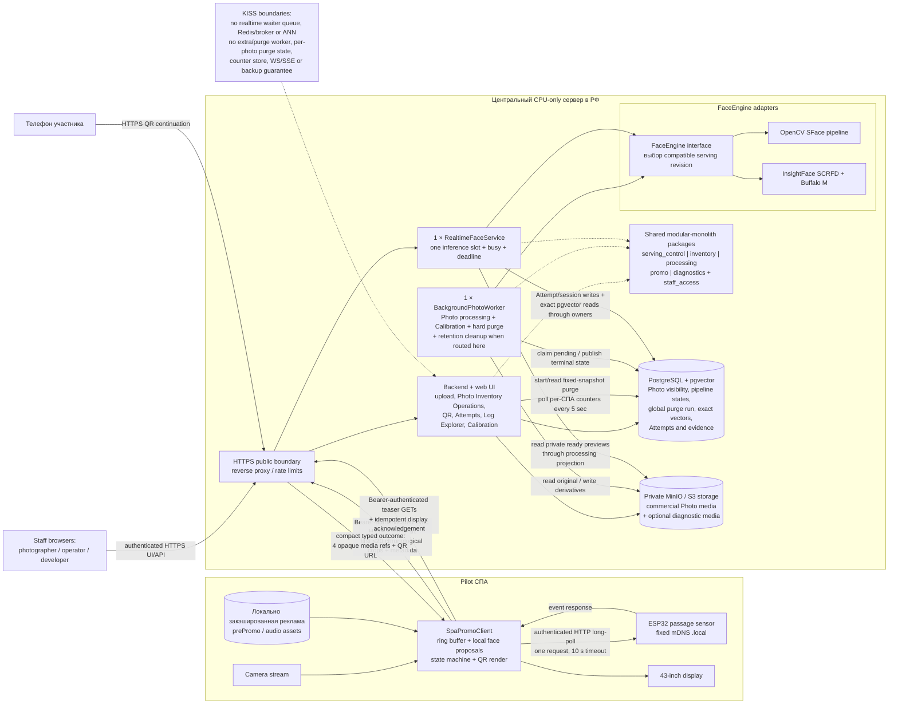

# 3. Runtime architecture

Минимальная single-server топология pilot. Это целевая архитектура, а не утверждение о текущей степени реализации.

## Ключевые границы

- `BackgroundPhotoWorker` и `RealtimeFaceService` разделены из-за разных latency и lifecycle требований.
- Пять capability slices являются package ownership, а не отдельными services.
- Realtime не ставит запросы в waiter queue: занятый slot возвращает `busy`.
- Client не ранжирует/top-5/deduplicate proposals и отправляет первые не более
  20 occurrences в chronological traversal order; zero-proposal request
  содержит только manifest.
- Общий request body ограничен `20 MiB`: больший body получает HTTP `413` до
  domain admission без core Attempt, oversize domain outcome или выбора subset.
- Realtime заранее загружает и прогревает только active serving revision;
  worker/Calibration могут использовать обе зарегистрированные native engine
  implementations, не смешивая revisions и не создавая ensemble.
- `inventory` владеет active/soft-deleted marker, direct PostgreSQL counters и
  одним resumable global purge run; worker ждёт текущую операцию без preemption.
- Hard purge удаляет Photo/media/faces/pipeline states, но сохраняет Promo
  result/session, core Attempt и diagnostic evidence; clients пропускают
  отсутствующую media.
- PostgreSQL, MinIO и внутренние service ports не публикуются наружу.
- Локальный HDMI client и будущий remote client используют один `SpaPromoClient` contract.

Источники:
[Architecture](../.memory-bank/architecture/system-architecture.md),
[Boundary map](../.memory-bank/contracts/boundary-map.md),
[Realtime Attempt API](../.memory-bank/contracts/realtime-attempt-api.md),
[Promo Display API](../.memory-bank/contracts/promo-display-api.md),
[QR Continuation API](../.memory-bank/contracts/qr-continuation-api.md),
[Foundation](../.memory-bank/foundation.md).
