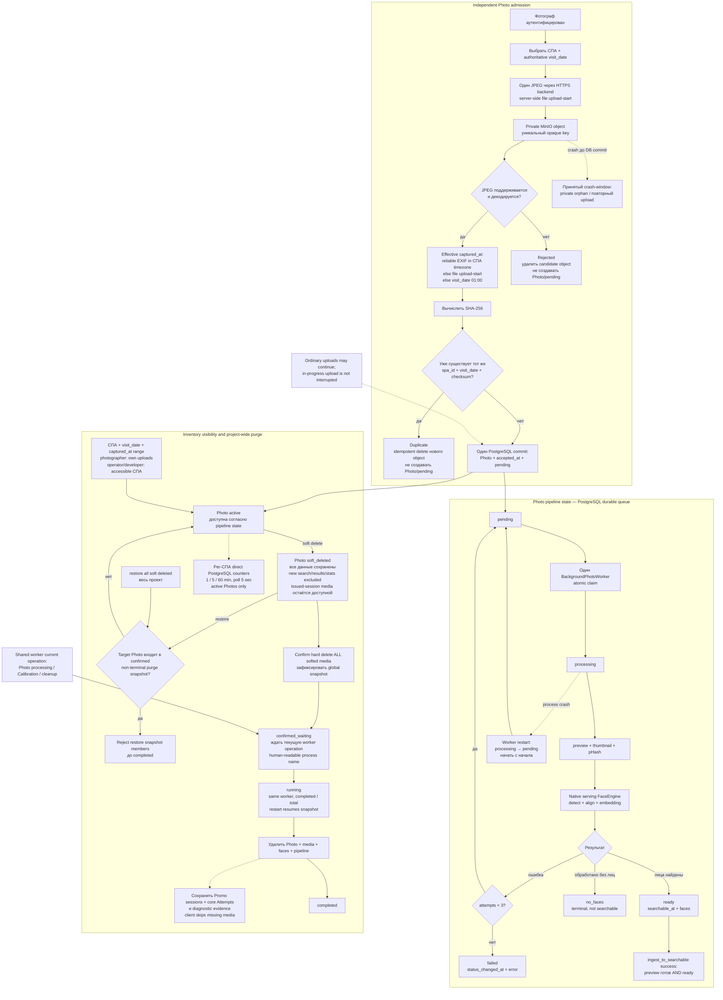

# 4. Ingest, processing and inventory lifecycle

Каждый JPEG проходит независимый admission. Photo processing state,
active/soft-deleted visibility и один global hard-purge run остаются разными
KISS-контурами.

## Семантика

- `ready` означает searchable face records конкретной `pipeline_revision`;
  `no_faces` является terminal outcome, но остаётся searchable-SLO breach.
- Повторное at-least-once выполнение не дублирует `photo_faces` или derivatives.
- Soft delete меняет один visibility marker и блокирует новые search/results,
  но не ломает уже выданную session; restore не запускает processing.
- `new` использует `accepted_at`; `unprocessed` — in-window accepted и текущие
  `pending|processing`; `processed`/`failed` используют соответствующий
  transition time. Все counters исключают soft-deleted Photos.
- Global purge snapshot фиксируется при confirmation. Soft deletes после
  confirmation ждут следующего запуска, а restore snapshot members отклоняется
  до completion.
- Batch, manifest, confirmation upload-а, per-photo `purge_pending`, отдельная
  jobs table, deletion worker, counter store и distributed transaction
  отсутствуют.

Источники: [Architecture](../.memory-bank/architecture/system-architecture.md),
[Lifecycle](../.memory-bank/states/lifecycle-map.md),
[IDEA_INGEST.md](../IDEA_INGEST.md), [PRD](../.memory-bank/prd.md).
