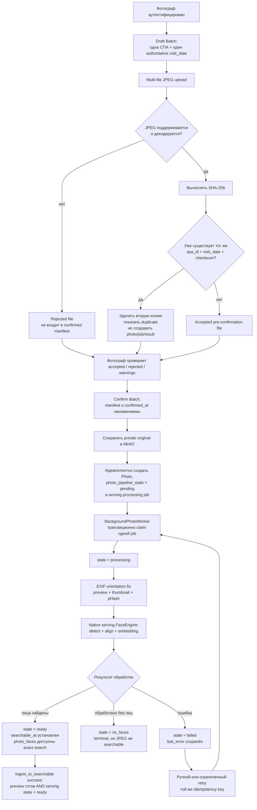

# 4. Ingest and processing lifecycle

Диаграмма разделяет pre-confirmation validation, immutable Batch и pipeline-specific состояние фотографии.

## Семантика состояний

- `ready` означает, что searchable face records созданы для конкретной `pipeline_revision`.
- `no_faces` — успешный terminal processing outcome, но остаётся breach метрики searchable.
- Повторное at-least-once выполнение не должно дублировать `photo_faces` или производные файлы.
- `visit_date` берётся из подтверждённой формы; EXIF `captured_at` остаётся вторичной метаданной.

Источники: [IDEA_INGEST.md](../IDEA_INGEST.md), [IDEA_APP.md](../IDEA_APP.md), [Glossary](../.memory-bank/glossary.md).
