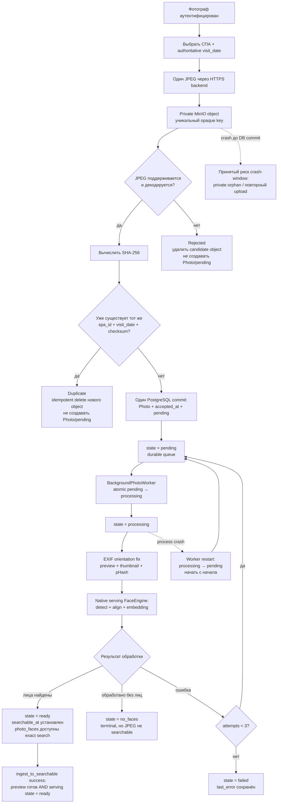

# 4. Ingest and processing lifecycle

Каждый JPEG проходит независимый admission и получает собственное
pipeline-specific состояние.

## Семантика состояний

- `ready` означает, что searchable face records созданы для конкретной `pipeline_revision`.
- `no_faces` — успешный terminal processing outcome, но остаётся breach метрики searchable.
- `pending`, `processing`, `failed` и `no_faces` после 15 минут остаются SLO breaches.
- Повторное at-least-once выполнение не должно дублировать `photo_faces` или производные файлы.
- `visit_date` выбирает фотограф; EXIF `captured_at` остаётся вторичной метаданной.
- Accepted original сохраняет первоначальный opaque key без MinIO move/copy.
- Batch, manifest, confirmation, отдельная jobs table и distributed transaction отсутствуют.

Источники: [Architecture](../arch_vision.md),
[IDEA_INGEST.md](../IDEA_INGEST.md), [IDEA_APP.md](../IDEA_APP.md),
[Glossary](../.memory-bank/glossary.md).
