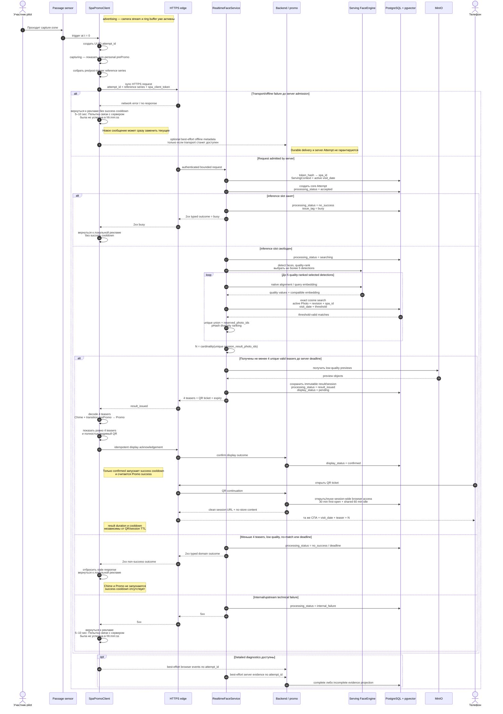

# 5. Realtime Promo sequence

Последовательность одной автоматической attempt: от sensor trigger до Promo или безопасного возврата к рекламе.

## Алгоритмические ограничения pilot

- Selected detection — occurrence лица, а не уникальный человек; tracking и identity deduplication отсутствуют.
- Embeddings разных detections не объединяются, а pipeline revisions никогда не смешиваются.
- `pHash` влияет только на разнообразие уже прошедших threshold фотографий.
- Promo существует только при четырёх уникальных valid teasers; partial result запрещён.
- Realtime waiter queue отсутствует; concurrent request получает `busy`.
- Server response не доказывает показ Promo: нужен отдельный display acknowledgement.
- Если display window завершился без acknowledgement, `unconfirmed` выводится
  при чтении; отдельный scheduler не нужен.
- Client-only offline trigger может не создать server Attempt; его metadata
  доставляется только best-effort без durable outbox.

Источники: [Architecture](../.memory-bank/architecture/system-architecture.md),
[IDEA_APP.md](../IDEA_APP.md),
[PRD](../.memory-bank/prd.md), [Glossary](../.memory-bank/glossary.md).
