# 5. Realtime Promo sequence

Последовательность одной автоматической attempt: от sensor trigger до Promo или безопасного возврата к рекламе.

```mermaid
sequenceDiagram
    autonumber
    actor Person as Участник pilot
    participant Sensor as Passage sensor
    participant Client as SpaPromoClient
    participant Edge as HTTPS edge
    participant API as RealtimeFaceService
    participant Backend as Backend / promo
    participant Engine as Serving FaceEngine
    participant DB as PostgreSQL + pgvector
    participant Store as MinIO
    actor Phone as Телефон

    Note right of Client: advertising — camera stream и ring buffer уже активны<br/>authenticated display config загружен с central origin
    Client->>Sensor: authenticated HTTP long-poll (10 s)
    Note over Sensor,Client: timeout → сразу следующий request, без Attempt
    Person->>Sensor: Проходит capture-zone
    Sensor-->>Client: passage event response at t = 0
    Client->>Sensor: открыть следующий long-poll
    Client->>Client: создать UUID attempt_id
    Client->>Client: capturing — показать non-personal prePromo
    Client->>Client: собрать pre/post-trigger reference series
    Client->>Client: marker: ready-series processing start
    Client->>Client: chronological BlazeFace traversal<br/>stop at occurrence 20, без ranking/top-5/dedup
    Client->>Client: crop + metadata для первых ≤20 occurrences
    Client->>Client: marker: request-send start
    Note right of Client: zero proposals → manifest-only request<br/>body >20 MiB → HTTP 413 до admission, без subset
    Client->>Edge: Bearer-authenticated sync HTTPS multipart<br/>attempt_id + first ≤20 occurrence crops/metadata
    Note right of Client: Каждый полученный response<br/>фиксирует response-received marker
    alt Transport/offline failure до server admission
        Edge--xClient: network error / no response
        Client->>Client: вернуться к рекламе без success cooldown<br/>5–10 sec: Попытка связи с сервером<br/>была не успешна в hh:mm:ss
        Note right of Client: Новое сообщение может сразу заменить текущее
        Client-->>Backend: optional best-effort offline metadata<br/>только если transport станет доступен
        Note right of Backend: Durable delivery и server Attempt не гарантируются
    else Request body larger than 20 MiB
        Edge-->>Client: HTTP 413 before domain admission
        Client->>Client: вернуться к локальной рекламе<br/>без core Attempt / oversize domain outcome
    else Auth, validation, rate limit, readiness or technical rejection
        Edge-->>Client: 401 / 422 / 429 / 503 or technical 5xx before admission
        Client->>Client: вернуться к локальной рекламе<br/>без core Attempt / domain outcome
    else Request admitted by server
        Edge->>API: authenticated bounded request

        API->>DB: token_hash → spa_id<br/>ServingContext + active visit_date
        API->>DB: создать core Attempt<br/>processing_status = accepted

        alt zero proposal occurrences
            API->>DB: processing_status = no_success<br/>domain_outcome = no_proposals
            API-->>Edge: 200 typed outcome = no_proposals
            Edge-->>Client: 200 no_proposals
            Client->>Client: вернуться к локальной рекламе<br/>без success cooldown
        else one or more proposal occurrences
            alt inference slot занят
                API->>DB: processing_status = no_success<br/>domain_outcome = busy
                API-->>Edge: 200 typed outcome = busy
                Edge-->>Client: 200 busy
                Client->>Client: вернуться к локальной рекламе<br/>без success cooldown
            else inference slot свободен
                API->>DB: processing_status = searching
                API->>Engine: inspect quality and rank occurrences<br/>выбрать не более 5 detections

                loop До 5 quality-ranked selected detections
                    API->>Engine: native detection / alignment / query embedding
                    Engine-->>API: quality values + compatible embedding
                    API->>DB: exact cosine search<br/>active Photo + revision + spa_id<br/>visit_date + threshold
                    DB-->>API: threshold-valid matches
                end

                API->>Store: read threshold-valid previews<br/>compute pHash on demand
                Store-->>API: private preview bytes
                API->>API: complete unique union + teaser diversity<br/>N = cardinality(session_result_photo_ids)

                alt Получены не менее 4 unique valid teasers до server deadline
                    API->>DB: сохранить immutable result/session<br/>processing_status = result_issued<br/>display_status = pending
                    API-->>Edge: 4 opaque media refs + N + QR URL + expiry
                    Edge-->>Client: 200 outcome = result

                    loop Ровно 4 teaser media references
                        Client->>Edge: Bearer-authenticated GET /api/promo/media/{ref}
                        Edge->>Backend: authorized teaser read
                        Backend->>Store: private preview read
                        Store-->>Backend: low-quality JPEG
                        Backend-->>Edge: no-store image/jpeg
                        Edge-->>Client: teaser JPEG
                    end

                    Client->>Client: decode 4 teasers + generate QR locally
                    alt Все 4 teasers и QR полностью видимы до display expiry
                        Client->>Client: Chime + transition prePromo → Promo
                        par Display acknowledgement
                            Client->>Edge: idempotent confirmed acknowledgement
                            Edge->>Backend: confirm display outcome
                            Backend->>DB: display_status = confirmed<br/>persist client monotonic elapsed
                        and QR continuation не зависит от acknowledgement
                            Phone->>Edge: GET /q?ticket=opaque
                            Edge->>Backend: ticket exchange
                            Backend->>DB: открыть/reuse shared browser access<br/>строго до 30 min first-open boundary<br/>затем shared 60 min explicit-activity idle
                            Backend-->>Edge: session cookie + 303 clean /phone
                            Edge-->>Phone: no-store redirect
                            Phone->>Edge: protected session/media reads
                            Edge->>Backend: cookie-authorized passive reads
                            Backend-->>Edge: та же СПА + visit_date + available teaser + N
                            Edge-->>Phone: no-store phone content
                        end
                        Note right of Client: Только confirmed запускает success cooldown<br/>display duration/cooldown независимы от QR/session TTL
                    else Media/decode/QR/render failure or display expiry
                        Client-->>Edge: best-effort failed report when still timely
                        Note right of Backend: Без timely report pending выводится<br/>как derived unconfirmed — scheduler отсутствует
                        Client->>Client: вернуться к локальной рекламе<br/>без Promo success/cooldown
                    end
                else Меньше 4 teasers, low quality, no-match или deadline
                    API->>DB: processing_status = no_success / deadline
                    API-->>Edge: 200 typed domain outcome
                    Edge-->>Client: 200 non-result outcome
                    Client->>Client: отбросить stale response<br/>вернуться к локальной рекламе
                    Note right of Client: Chime и Promo не запускаются<br/>success cooldown отсутствует
                else Internal/upstream technical failure
                    API->>DB: processing_status = internal_failure
                    API-->>Edge: 5xx
                    Edge-->>Client: 5xx
                    Client->>Client: вернуться к рекламе<br/>5–10 sec: Попытка связи с сервером<br/>была не успешна в hh:mm:ss
                end
            end
        end

        opt Detailed diagnostics доступны
            Client-->>Backend: best-effort browser events по attempt_id
            API-->>Backend: best-effort server evidence по attempt_id
            Backend->>DB: complete либо incomplete evidence projection
        end
    end
```

## Алгоритмические ограничения pilot

- Selected detection — occurrence лица, а не уникальный человек; tracking и identity deduplication отсутствуют.
- Client отправляет первые не более 20 proposal occurrences в chronological
  traversal order с допустимыми повторами; server contract, а не client,
  владеет selection до пяти detections.
- Body больше `20 MiB` получает HTTP `413` до domain admission; client не
  выбирает subset для обхода лимита, core Attempt и oversize domain outcome не
  создаются.
- Embeddings разных detections не объединяются, а pipeline revisions никогда не смешиваются.
- `pHash` влияет только на разнообразие уже прошедших threshold фотографий.
- Promo существует только при четырёх уникальных valid teasers; partial result запрещён.
- Realtime waiter queue отсутствует; concurrent request получает `busy`.
- Server response не доказывает показ Promo: нужен отдельный display acknowledgement.
- Если display window завершился без acknowledgement, `unconfirmed` выводится
  при чтении; отдельный scheduler не нужен.
- Client-only offline trigger может не создать server Attempt; его metadata
  доставляется только best-effort без durable outbox.
- ESP32 trigger приходит как response на один authenticated 10-second HTTP
  long-poll к fixed mDNS `.local` name; обычный timeout сразу продолжает polling
  и не создаёт Attempt.
- `<10 s` измеряется одним client monotonic clock от начала local processing и
  включает crop preparation и request send.
- Full/downscaled reference-frame upload и доказательство local-detector misses
  не являются обязательными.

Источники: [Architecture](../.memory-bank/architecture/system-architecture.md),
[Boundary map](../.memory-bank/contracts/boundary-map.md),
[Sensor Passage API](../.memory-bank/contracts/sensor-passage-api.md),
[Realtime Attempt API](../.memory-bank/contracts/realtime-attempt-api.md),
[Promo Display API](../.memory-bank/contracts/promo-display-api.md),
[QR Continuation API](../.memory-bank/contracts/qr-continuation-api.md),
[Realtime Search](../.memory-bank/domains/realtime-search.md),
[Promo Attempt](../.memory-bank/domains/promo-attempt.md).
