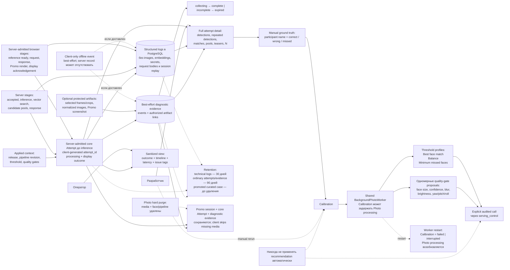

# 6. Diagnostics and calibration

Для server-admitted request core Attempt сохраняет обязательный outcome и
timeline; protected evidence, annotation и Calibration образуют отдельный
developer-only контур, а оператор получает только sanitized view. Client-only
offline event может не оставить server record.

## Как пользоваться

1. Найти slow/failed/suspicious attempt по времени, status, release, pipeline, latency или issue tags.
2. Локализовать задержку по единому browser/server timeline.
3. Проверить фактические detections, candidate pools, teasers, `N`, версии и параметры.
4. Добавить ground truth и открыть вклад в threshold или отдельный quality gate.
5. Сравнить release/config sets и вручную применить выбранное изменение.

Detailed evidence не является prerequisite participant flow. Для существующего
server Attempt отсутствующий или незавершённый evidence set отображается как
`incomplete`; client-only offline event может полностью отсутствовать на
сервере. Отдельный diagnostic anchor, priority scheduler и отдельный Calibration
worker не создаются.
Photo hard purge не каскадирует в Promo session, core Attempt или diagnostic
evidence; missing media пропускается при UI/device loading.

Источники: [Architecture](../arch_vision.md), [IDEA_DEBUG.md](../IDEA_DEBUG.md),
[PRD](../.memory-bank/prd.md), [Glossary](../.memory-bank/glossary.md).
