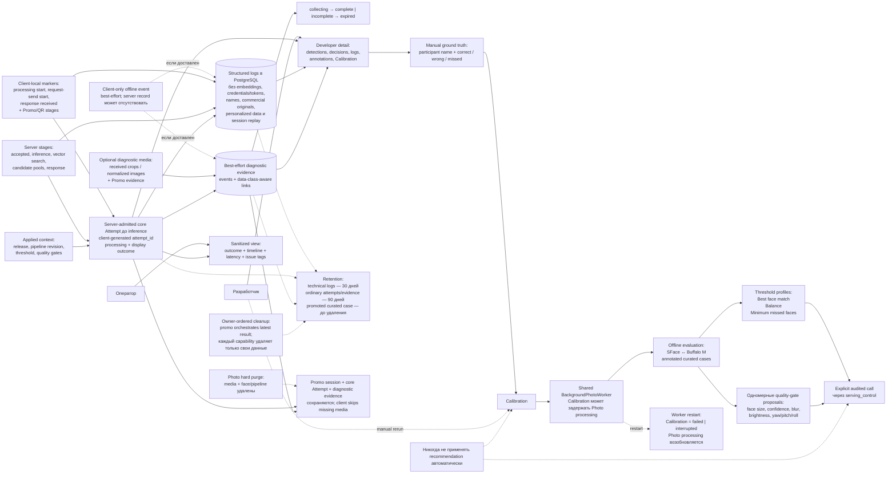

# 6. Diagnostics and calibration

Для server-admitted request core Attempt сохраняет обязательный outcome и
timeline; protected diagnostic data/actions остаются developer-only, а
capture-derived media не получает этот статус только из-за image content.
Операторский Attempts view остаётся sanitized. Client-only offline event может
не оставить server record.

## Как пользоваться

1. Найти slow/failed/suspicious attempt по времени, status, release, pipeline, latency или issue tags.
2. Локализовать задержку по единому browser/server timeline.
3. Проверить фактические detections, candidate pools, teasers, `N`, версии и параметры.
4. Добавить ground truth и открыть вклад в threshold или отдельный quality gate.
5. Сравнить release/config sets и вручную применить выбранное изменение.

Detailed evidence не является prerequisite participant flow. Для существующего
server Attempt отсутствующий или незавершённый evidence set отображается как
`incomplete`; client-only offline event может полностью отсутствовать на
сервере. Capture-derived media может логироваться, кэшироваться, храниться или
отдаваться без developer-only media authorization, но ни один такой механизм
не обязателен. Reference-frame upload и proof local-detector misses не требуются.
Отдельный diagnostic anchor, priority scheduler и отдельный Calibration worker
не создаются.
Photo hard purge не каскадирует в Promo session, core Attempt или diagnostic
evidence; missing media пропускается при UI/device loading.

Источники: [Architecture](../.memory-bank/architecture/system-architecture.md),
[Boundary map](../.memory-bank/contracts/boundary-map.md),
[Lifecycle](../.memory-bank/states/lifecycle-map.md),
[FT-007](../.memory-bank/features/FT-007.md),
[FT-008](../.memory-bank/features/FT-008.md),
[FT-009](../.memory-bank/features/FT-009.md),
[FT-010](../.memory-bank/features/FT-010.md),
[FT-011](../.memory-bank/features/FT-011.md),
[Calibration verification](../.memory-bank/testing/calibration.md).
