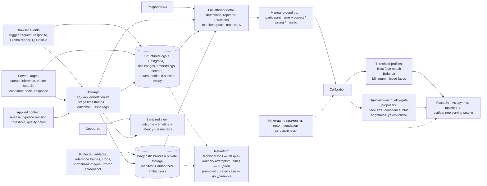

# 6. Diagnostics and calibration

Developer-only контур превращает одну проблемную attempt в объяснимое расследование и ручное решение по параметрам.

## Как пользоваться

1. Найти slow/failed/suspicious attempt по времени, status, release, pipeline, latency или issue tags.
2. Локализовать задержку по единому browser/server timeline.
3. Проверить фактические detections, candidate pools, teasers, `N`, версии и параметры.
4. Добавить ground truth и открыть вклад в threshold или отдельный quality gate.
5. Сравнить release/config sets и вручную применить выбранное изменение.

Источники: [IDEA_DEBUG.md](../IDEA_DEBUG.md), [PRD](../.memory-bank/prd.md), [Glossary](../.memory-bank/glossary.md).
