# 7. Features in architecture and runtime

Карта показывает, где двенадцать product Features находятся относительно
capability ownership и четырёх runtime surfaces pilot. `FT-000` вынесен
отдельно: это уже verified executable substrate, а не пользовательская
Feature. `FT-001..FT-012` остаются target design с `lifecycle: planned` и
завершённым SDD design.

```mermaid
flowchart TB
    subgraph feature_map["Product decomposition"]
        direction TB
        foundation["FT-000 · Executable Foundation<br/>verified substrate, не product Feature"]

        subgraph ep1["EP-001 · Fresh Searchable Inventory"]
            direction LR
            ft001["FT-001<br/>Photo admission"]
            ft002["FT-002<br/>Processing + searchable readiness"]
            ft012["FT-012<br/>Inventory operations + counters"]
        end

        subgraph ep2["EP-002 · Automatic Promo + QR Continuation"]
            direction LR
            ft003["FT-003<br/>Sensor-triggered capture"]
            ft004["FT-004<br/>Realtime search + result assembly"]
            ft005["FT-005<br/>Promo presentation"]
            ft006["FT-006<br/>QR phone continuation"]
        end

        subgraph ep3["EP-003 · Explainable Diagnostics + Calibration"]
            direction LR
            ft007["FT-007<br/>Correlated Attempt evidence"]
            ft008["FT-008<br/>Role-scoped Attempts"]
            ft009["FT-009<br/>Log Explorer"]
            ft010["FT-010<br/>Ground-truth annotation"]
            ft011["FT-011<br/>Explainable Calibration"]
        end
    end

    subgraph release["Один Python/FastAPI modular-monolith release"]
        direction TB

        subgraph capabilities["Capability ownership — one write owner per mutable invariant"]
            direction LR
            access["staff_access<br/>authentication support"]
            serving["serving_control<br/>СПА/date/settings/revision"]
            inventory["inventory<br/>Photo admission/visibility/purge"]
            processing["processing<br/>pipeline/search/evaluation"]
            promo["promo<br/>Attempt/result/display/QR"]
            diagnostics["diagnostics<br/>evidence/logs/annotation/Calibration"]
        end

        subgraph server_runtime["Server runtime entrypoints from the same release"]
            direction LR
            backend["backend<br/>staff UI/API · ingest/inventory<br/>QR · diagnostics"]
            realtime["RealtimeFaceService<br/>one warmed active model<br/>one non-blocking inference slot"]
            worker["BackgroundPhotoWorker<br/>one sequential operation:<br/>Photo · Calibration · purge · cleanup"]
        end
    end

    subgraph site_runtime["Pilot СПА runtime"]
        direction LR
        sensor["ESP32<br/>10 s authenticated long-poll"]
        camera["Camera"]
        client["SpaPromoClient<br/>central-origin Chromium<br/>capture/proposals/display"]
        display["Promo display"]
        phone["Participant phone"]
    end

    edge["Public HTTPS edge"]
    postgres[("Private PostgreSQL + pgvector<br/>one schema + one migration stream")]
    minio[("Private MinIO<br/>binary bytes")]

    ft001 --> inventory
    ft001 --> access
    ft002 --> processing
    ft002 --> inventory
    ft012 --> inventory
    ft012 --> processing

    ft003 --> client
    ft003 --> promo
    ft004 --> processing
    ft004 --> promo
    ft005 --> client
    ft005 --> promo
    ft006 --> promo
    ft006 --> phone

    ft007 --> promo
    ft007 --> diagnostics
    ft007 --> client
    ft008 --> diagnostics
    ft009 --> diagnostics
    ft010 --> diagnostics
    ft011 --> diagnostics
    ft011 --> processing
    ft011 --> serving

    access -. "authenticate only" .-> backend
    serving -. "settings/readiness" .-> backend
    inventory -. "staff outcomes" .-> backend
    promo -. "display/QR" .-> backend
    diagnostics -. "protected views" .-> backend

    serving -. "immutable context" .-> realtime
    inventory -. "active Photo projection" .-> realtime
    processing -. "selection + exact search" .-> realtime
    promo -. "admission + result owner" .-> realtime

    processing -. "Photo work" .-> worker
    diagnostics -. "Calibration" .-> worker
    inventory -. "fixed-snapshot purge" .-> worker
    promo -. "retention cleanup when routed here" .-> worker

    camera --> client
    client --> display
    client -->|"HTTP long-poll"| sensor
    client -->|"bounded realtime + media/display API"| edge
    phone -->|"QR continuation"| edge
    edge --> backend
    edge --> realtime

    backend --> postgres
    backend --> minio
    realtime --> postgres
    realtime --> minio
    worker --> postgres
    worker --> minio

    foundation -. "verified baseline" .-> backend
    foundation -. "verified baseline" .-> realtime
    foundation -. "verified baseline" .-> worker
    foundation -. "verified baseline" .-> postgres
    foundation -. "verified baseline" .-> minio

    classDef foundationStyle fill:#d9ead3,stroke:#38761d,color:#1f1f1f;
    classDef epic1Style fill:#d9eaf7,stroke:#3d78a8,color:#1f1f1f;
    classDef epic2Style fill:#fce5cd,stroke:#c97a29,color:#1f1f1f;
    classDef epic3Style fill:#eadcf8,stroke:#7e57a1,color:#1f1f1f;
    classDef capabilityStyle fill:#fff2cc,stroke:#a67c00,color:#1f1f1f;
    classDef runtimeStyle fill:#eeeeee,stroke:#666666,color:#1f1f1f;
    classDef boundaryStyle fill:#f4cccc,stroke:#a61c00,color:#1f1f1f;

    class foundation foundationStyle;
    class ft001,ft002,ft012 epic1Style;
    class ft003,ft004,ft005,ft006 epic2Style;
    class ft007,ft008,ft009,ft010,ft011 epic3Style;
    class access,serving,inventory,processing,promo,diagnostics capabilityStyle;
    class backend,realtime,worker,client,sensor,camera,display,phone runtimeStyle;
    class edge,postgres,minio boundaryStyle;
```

## Как читать

- Сплошная связь от Feature показывает её primary capability owner или
  значимую client-side поверхность. Supporting dependencies намеренно не
  размножены; полный разрешённый `Consumer -> Provider` graph остаётся в
  canonical Boundary Map.
- Пунктир от capability к process показывает основной runtime, где исполняется
  поведение. Capability packages не являются services: `backend`,
  `RealtimeFaceService` и `BackgroundPhotoWorker` собираются из одного release.
- `SpaPromoClient`, ESP32, PostgreSQL и MinIO — runtime/external parties, а не
  дополнительные project change units. PostgreSQL и MinIO доступны только
  через capability-owned application/repository boundaries.
- FT-004 намеренно связан и с `processing`, и с `promo`: первый владеет
  server-side selection/exact search, второй — Attempt, union, teasers, `N` и
  result session. FT-007 аналогично разделяет обязательный core Attempt и
  best-effort diagnostic detail.

Источники: [Feature Index](../.memory-bank/features/index.md),
[Requirements RTM](../.memory-bank/requirements.md),
[System Architecture](../.memory-bank/architecture/system-architecture.md),
[Boundary Map](../.memory-bank/contracts/boundary-map.md),
[Lifecycle Map](../.memory-bank/states/lifecycle-map.md),
[Foundation](../.memory-bank/features/FT-000-foundation.md).
